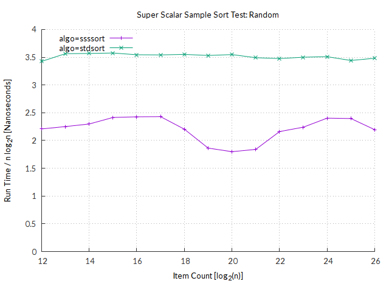

# ssssort — Super Scalar Sample Sort

This is an implementation of
[Super Scalar Sample Sort](http://citeseerx.ist.psu.edu/viewdoc/download?doi=10.1.1.72.366&rep=rep1&type=pdf)
in modern C++.  It is faster than `std::sort` in many cases, but uses quite a
bit of additional memory (up to 2-3x input size).  This means that it's not
applicable in all situations, but when it is, it's pretty damn quick!

## Benchmarks

We performed some tests with sorting integers and compared Super Scalar Sample
Sort to `std::sort`. Most notably, when sorting random integers, our
implementation was between 35 and 50% faster than `std::sort`! The plot below
shows the time divided by `n log(n)`, where `n` is the input size. We chose this
normalization because that's the lower bound on comparison-based sorting you may
remember from your algorithms class.  Thus the plot shows the time spent per
required comparison.

`std::sort` is awfully fast on data that is already sorted (both
[in the right](plots/sorted.png) and [reverse order](plots/reverse.png)). We
can't match that.  However, as soon as even 0.1% of elements aren't in the right
place, its advantage [breaks down immediately](plots/99.9pcsorted)!  This is
also true when the first 99% of the array are sorted, and only the
[last 1% contains random data](plots/99pctail.png).

You can find plots for some more workloads in the [plots](plots/)
folder, or suggest new benchmarks by filing an issue.

We performed our experiments on a beefy machine with dual Intel Xeon E5-2670 v3
Haswell 12-core CPUs and 128 GiB of DDR4-2133, but only used one core to keep
things reproducible. All numbers are averages over 100 runs.

## Implementation

The implementation is fairly close to the paper, but uses `std::sort` as base
case for sorting less than 1024 elements.  As-is the code technically requires a
C++14 compiler, even though `g++` is happy to compile it with `-std=c++11`.  The
requirement stems from the use of a variable declaration in the `find_bucket`
function, which is marked `constexpr`.  You can simply replace `constexpr` with
`inline` to make it valid C++11.

## Todo list

It doesn't quite work that well with complex objects yet - it does sort them
using `operator<`, but leaks objects all over the place.  I'll have to figure
out where those are lost at some point.

Also, the paper authors' original implementation is still a bit faster than this
one, but it's not open source, nor is it in publishable condition...
